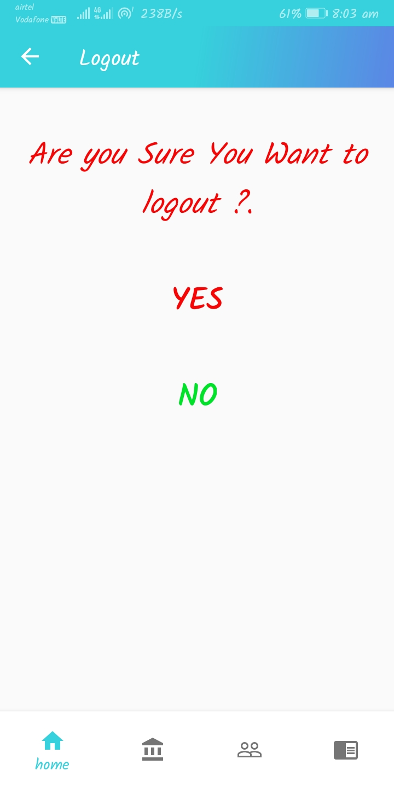
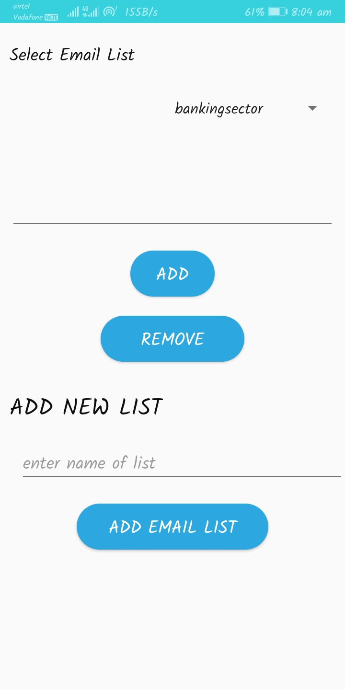

# MK23_WEBREBELS

**Financial Alert System** - an android app under construction of team *WebRebels*, for solving the issues of finance ministry according to their problem statement.

Supports tabular data with Selection of  Sector for various purpose, and tab-based visual display.

ℹ️ This module is meant to be run using Android studio or via android device only. It does not work from a web browser.

This app combined with the following activities:

* Login/Signup
* Enable/Disable the email updates
* Enable/Disable notification updates
* Feedback
* Share,Logout and FAQ

ℹ️ The **FAQ** fragment is designed and integrated with a chatbot system for answering queries. 

There are two more options available to see the reports and the name of users who have seen a notice

## Screenshots

 &nbsp;       &nbsp;  
 

* The screenshots above include of a application launching splash screen with the app logo and the Login page. User can either login or Signup with simply by gmail account. After login user can simply see the updates from respective ministry in the various tabs. Search feature is enabled to make it more easier for user to get required notice.
 

 &nbsp;       &nbsp;  
 

* The screenshots above include of a application side navigation drawer where user can find various options for desired function. User can delete the account, enable or disable the email updates or notication updates as per his/her will. Notify feature is linked with the firebase database for immediate popup notification as the new notice added.
 

 &nbsp;       &nbsp;  
 

* The screenshots above include of a application feedback with stars rating. User can simply logout by confirming once and again reach back to the login page. A button named Login as Admin can be used by officials by entering secrete code they will be directed to admin panel, where they can find several options like View all notices , send mail to a particular official, Edit the mail list and upload the new notice. 
 

 &nbsp;       &nbsp;  
 

* The screenshots above include of a application all notices where clicking on any of the notice Admin has various powers to perform actions with the notice where seen by feature allows Admin to check the viewers of the notice. Admin can Edit the email list as delete or change according to the need. On clicking to the upload notice Admin is allowed to upload new notice in any format with desired requirements.
